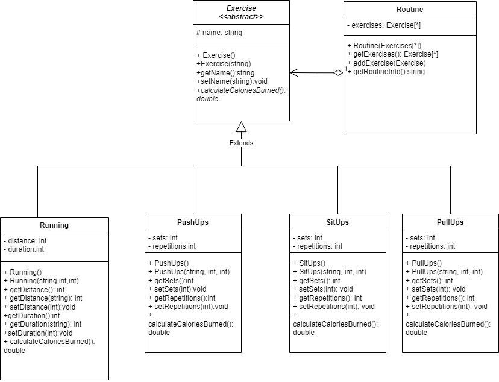

# StepSync
This project is all about staying fit and healthy using an app which lets you see recommended exercise routines, based on your age, sex, height and weight. This project is set to help people mantain a daily routine of exercises, especially young adults, as with the amount of workload begining to increase more and more, people begin to exercise less, making more sick. The specific target audience for this project is for people between 18-50 years as these are the people with the poorest lifespan due to poor health.  
 I created this project due to the high amount of recent people who, thanks to the pandemic, didn't exerciced enough making them much more likely to get heart attacks or worse. I believe making a program which encourages physical activity as a form of daily habit is pretty important not only for one only person, but as a whole society, as making this types of projects can lead to the evasion of future health problems allowing the people to mantain a high lifespan through their whole lifes.  

