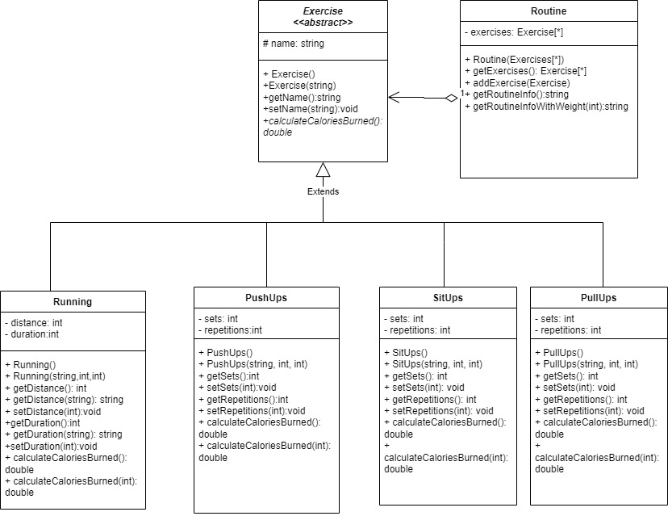

# StepSync
This project is all about staying fit and healthy using an app which lets you see recommended exercise routines, based on your age, sex, height and weight. This project is set to help people mantain a daily routine of exercises, especially young adults, as with the amount of workload begining to increase more and more, people begin to exercise less, making more sick. The specific target audience for this project is for people between 18-50 years as these are the people with the poorest lifespan due to poor health.  
 I created this project due to the high amount of recent people who, thanks to the pandemic, didn't exerciced enough making them much more likely to get heart attacks or worse. I believe making a program which encourages physical activity as a form of daily habit is pretty important not only for one only person, but as a whole society, as making this types of projects can lead to the evasion of future health problems allowing the people to mantain a high lifespan through their whole lifes.  
 This program consist of a fitness app which ask the user their weight, age and gender, whose values are then displayed and stored for further use, then a choice will appear to the user, the program will keep on looping until the user presents a valid option or they choose the option to exit the program by themselves. When the user chooses the option to get a routine of several exercises, the program will then start generating a vector which contains all the different recommended exercise routines for the user based on the data introduced at the beginning, and ones it finishes, it will once again present a choice to the user to exit the program, if they choose to exit the program closes automatically, while if they choose the contrary they remain until they choose to exit. Alternatetive, the user can create their own exercise routine, following the same algorithm as before, but now with the opportunity to change the parameters. At the end of the program the created routine will be saved in a text file for further watch.  

# Instalation instructions
1. Download every .cpp and .h files in the repository
2. Move the files into a easy to identify directory
3. Open the terminal using cmd, and once there use cd to reach the directory location
4. In the terminal console write the following line: g++ StepSync.cpp -o "Name of your executable file".exe
5. To execute the created file in the console, write the name of your created file with or without the .exe
6. Enjoy the app
